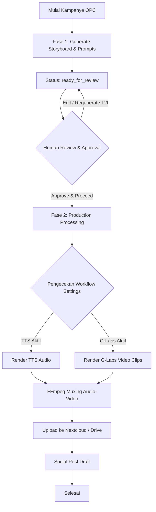

# **BLUEPRINT SISTEM: ORGANIC PILLAR CAMPAIGN (OPC) V10.20.47**

Dokumen ini merangkum arsitektur, skema database, aturan alur kerja (workflow), mekanisme VSO, serta antarmuka pemulihan aset dari fitur **Organic Pillar Campaign (OPC)** yang telah sepenuhnya dikembangkan dan diintegrasikan pada MAKNA Engine V10.20.47.

---

## **1. PARADIGMA KONTEN & VALUE PROPOSITION**

OPC dirancang dengan pendekatan *Top-Down Creative Strategy* yang berorientasi pada retensi audiens organik dengan menggunakan struktur **Sandwich Placement (Soft-Selling)**.

*   **Zona 1: The Core Hook (Klip 1)**
    Membuka video murni menggunakan teks "Hook" yang dimasukkan pengguna. Fokus penuh pada retensi 3-5 detik pertama tanpa menyebut produk.
*   **Zona 2: The Organic Companion (Klip 2/Bridging Clip)**
    Produk disisipkan secara halus sebagai properti pelengkap aktivitas (misalnya: *"Sambil ngebahas ini, aku kebetulan lagi rutin pakai [Nama Produk] karena [USP]..."*). Visual pada klip ini dikunci menggunakan **Hybrid Lock Mode** (Imagen 4 T2I -> Veo 3.1 Lite / Kling I2V) demi menjaga konsistensi bentuk produk dari foto referensi.
*   **Zona 3: Pillar Continuation (Klip 3, 4, dst.)**
    Narasi dan visual wajib kembali fokus 100% membahas topik utama (**Pilar Konten**) tanpa mempromosikan produk lagi. Menghindari impresi iklan *hard-sell* sehingga penonton mendapatkan nilai edukasi utuh.

---

## **2. STRUKTUR DATABASE (data/makna.db)**

Konfigurasi kampanye OPC dan item-itemnya disimpan dalam dua tabel utama yang saling berelasi:

### **Tabel: `pillar_campaigns`**
Menyimpan konfigurasi utama kampanye, termasuk preferensi AI, VSO, dan setelan workflow.
```sql
CREATE TABLE IF NOT EXISTS pillar_campaigns (
  id TEXT PRIMARY KEY,
  campaign_name TEXT NOT NULL,
  status TEXT DEFAULT 'pending',
  content_pillar TEXT NOT NULL,
  custom_hook TEXT NOT NULL,
  visual_action_guideline TEXT NOT NULL,
  custom_instruction TEXT,
  brand_profile_id TEXT REFERENCES brand_profiles(id) ON DELETE SET NULL,
  narrative_mode TEXT DEFAULT 'Storytelling',
  visual_style TEXT DEFAULT 'Cinematic',
  face_visibility TEXT DEFAULT 'Faceless',
  is_bridging_active INTEGER DEFAULT 0,
  target_clips_count INTEGER DEFAULT 4,
  bridge_at_clip INTEGER DEFAULT 2,
  bridge_duration_clips INTEGER DEFAULT 1,
  bridging_mode TEXT DEFAULT 'select_existing',
  target_product_id TEXT REFERENCES product_extractions(id) ON DELETE SET NULL,
  ephemeral_product_data TEXT,
  aspect_ratio TEXT DEFAULT '9:16',
  target_ai TEXT DEFAULT 'Google Veo (8s)',
  video_model TEXT DEFAULT 'veo_31_lite',
  visual_mode TEXT DEFAULT 'hybrid_lock',
  product_ref_image_path TEXT,
  product_filename_declare TEXT,
  visual_overrides_json TEXT,            -- Konfigurasi VSO (JSON string)
  enable_tts INTEGER DEFAULT 0,          -- Default: Nonaktif (0)
  enable_glabs INTEGER DEFAULT 0,        -- Default: Nonaktif (0)
  enable_ffmpeg INTEGER DEFAULT 0,       -- Default: Nonaktif (0)
  enable_social_post INTEGER DEFAULT 0,  -- Default: Nonaktif (0)
  upload_markdown INTEGER DEFAULT 0,
  upload_spreadsheet INTEGER DEFAULT 0,
  target_spreadsheet_id TEXT,
  target_markdown_url TEXT,
  local_scheduler INTEGER DEFAULT 1,      -- Default: Aktif (1) agar diproses otomatis oleh skeduler lokal
  scheduler_pause_at TEXT,
  voice_provider TEXT DEFAULT 'minimax',
  voice_persona TEXT DEFAULT 'Indonesian_SweetGirl',
  words_per_clip TEXT DEFAULT '17-19 kata',
  created_at DATETIME DEFAULT CURRENT_TIMESTAMP
);
```

### **Tabel: `pillar_campaign_items`**
Menyimpan status eksekusi tiap tahapan untuk setiap item di bawah kampanye terkait.
```sql
CREATE TABLE IF NOT EXISTS pillar_campaign_items (
  id INTEGER PRIMARY KEY AUTOINCREMENT,
  campaign_id TEXT NOT NULL REFERENCES pillar_campaigns(id) ON DELETE CASCADE,
  generation_status TEXT DEFAULT 'pending', -- 'pending', 'processing', 'completed', 'failed'
  result_json TEXT,                          -- Output naskah & prompt dari Gemini
  new_video_plan_json TEXT,                  -- Rencana storyboard & prompt T2I/I2V hasil editan/konfirmasi
  video_dna_json TEXT,                       -- Metadata Video DNA
  t2i_images_json TEXT,                      -- Array path lokal T2I Start Frames
  tts_status TEXT DEFAULT 'pending',         -- 'pending', 'processing', 'completed', 'skipped', 'failed'
  tts_batch_id TEXT,
  visual_status TEXT DEFAULT 'pending',      -- 'pending', 'processing', 'completed', 'skipped', 'failed'
  visual_tasks_json TEXT,
  visual_clip_paths TEXT,
  ffmpeg_status TEXT DEFAULT 'pending',       -- 'pending', 'processing', 'completed', 'skipped', 'failed'
  ffmpeg_output_path TEXT,
  upload_status TEXT DEFAULT 'pending',       -- 'pending', 'completed', 'failed'
  drive_link TEXT,                           -- Tautan file MD / Video gabungan di Drive / Nextcloud
  nextcloud_folder_url TEXT,                 -- Tautan folder publik Nextcloud
  social_post_status TEXT DEFAULT 'pending',  -- 'pending', 'processing', 'completed', 'skipped', 'failed'
  social_links_json TEXT,
  t2i_start_frame_path TEXT,
  retry_count INTEGER DEFAULT 0,
  workflow_status TEXT DEFAULT 'draft',      -- 'draft', 'ready_for_review', 'production_processing', 'completed', 'failed'
  created_at DATETIME DEFAULT CURRENT_TIMESTAMP
);
```

---

## **3. ATURAN VSO (VISUAL SWAP OVERRIDES) & SANITASI SANITIZATION (V10.20.47)**

Guna mencegah kebocoran gaya artistik (*style leakage*), aturan penyusunan VSO diberlakukan secara ketat:

1. **Sanitasi `visual_style_preset`**:
   - Properti `visual_style_preset` **hanya diperbolehkan berisi nilai string** (seperti `'3d_claymation_cozy'`, `'kawaii_flat_vector'`, `'ghibli_watercolor'`) apabila `subject_demographic` diawali oleh `mascot_universe_*` (Semesta Maskot Otonom).
   - Apabila demografi yang dipilih adalah **Demografi Manusia** (`syari_classic`, `caucasian_male`, dll.), `visual_style_preset` **WAJIB bernilai `null`**. Hal ini menjamin generator prompt tidak pernah menyuntikkan arahan gaya lempung 3D pada model manusia dan tetap mematuhi `visual_style` utama (seperti *Cinematic / Photorealistic*).
2. **Definisi Demografi Pria Kaukasia (Definition B)**:
   - `caucasian_male`: Pria Kaukasia berbusana kasual rapi, menyorot tangan dan lengan dari siku ke bawah (*cropped from elbow down*), kulit halus bersih, jam tangan elegan tipis, berinteraksi secara alami dengan produk di area kerja tanpa memperlihatkan wajah/kepala.

---

## **4. ALUR KERJA & ATURAN DEPENDENSI (HUMAN-IN-THE-LOOP WORKFLOW)**

OPC mengadopsi alur kerja **2-Fase (Human-in-the-Loop)**:



### **Detail Aturan Workflow:**
1. **Fase 1 (Creative Design)**: Gemini AI menyusun naskah voiceover, prompt T2I start frame, dan prompt I2V motion video. Status item berubah menjadi `ready_for_review`.
2. **Human-in-the-Loop Review**: Pengguna dapat mengubah naskah VO, meregenerasi gambar Start Frame T2I (secara per-klip atau batch), dan mengedit instruksi visual sebelum mengklik **"Approve & Proceed to Production"**.
3. **Fase 2 (Automated Production)**: Setelah disetujui, skeduler menjalankan eksekusi audio TTS, rendering video G-Labs (Veo/Kling), penggabungan FFmpeg, dan sinkronisasi Cloud.

---

## **5. DEPARTEMEN ASET & PEMULIHAN (TAB 4: ASET & RECOVERY)**

Terdapat tab khusus **`☁️ Tab 4: Aset & Recovery`** pada halaman detail kampanye yang memberikan kendali penuh terhadap aset parsial:

*   **Manual Cloud Sync Engine (`lib/manual-asset-uploader.js`)**: Memindai file fisik lokal di server (Start Frames T2I, Motion Clips I2V, Audio TTS MP3, Naskah Markdown, dan Video Muxed Final) dan mengunggahnya ke Nextcloud WebDAV atau Google Drive kapan saja tanpa perlu menunggu seluruh pipeline selesai.
*   **Granular Per-Clip Recovery**: Tabel inspeksi per klip yang menampilkan status ketersediaan aset T2I, I2V, dan TTS, serta menyediakan tombol `🔄 Retry I2V Only` untuk memicu ulang render klip tertentu yang mengalami timeout/kegagalan tanpa merusak klip lain yang sudah berhasil.

---

## **6. ANTARMUKA PENGGUNA (UI DESIGN & NAVIGATION)**

### **6.1 Form Input Konfigurasi Kampanye (`/pillar-campaigns`)**

Halaman utama pembuatan kampanye OPC menggunakan antarmuka berbasis Accordion 5 Section untuk mempermudah pengaturan parameter kreatif, visual, dan workflow:

1. **Section 1: Basic Creative Strategy**
   - **Input Nama Kampanye**: Identifier utama nama kampanye.
   - **Pilar Konten**: Tema atau topik utama edukasi video.
   - **Custom Hook**: Kalimat pembuka 3-5 detik pertama.
   - **Visual Action Guideline**: Arahan pergerakan kamera dan aksi visual adegan pembuka.
   - **Pemilihan Profile Brand**: Tautan ke brand DNA di `brand_profiles`.
2. **Section 2: Aesthetics & Visual Settings**
   - **Narrative Mode**: Mode penulisan narasi cerita (seperti *Storytelling*).
   - **Visual Style**: Gaya visual utama video (seperti *Cinematic*).
   - **Target AI Engine**: Engine model generator video target (misalnya *Google Veo (8s)* atau *Kling*).
   - **Aspect Ratio**: Skala aspek rasio video (`9:16` atau `16:9`).
   - **Faceless Option**: Saklar visibilitas wajah (*Faceless* atau menggunakan karakter manusia).
   - **Target Jumlah Kata/Klip**: Kepadatan durasi teks voiceover per klip (seperti *17-19 kata*).
3. **Section 3: Product Bridging Settings**
   - **Saklar Aktivasi Product Bridging**: Mengaktifkan atau menonaktifkan penyisipan promosi produk.
   - **Jumlah Total Klip**: Jumlah klip keseluruhan dalam satu video (default: 4 klip).
   - **Posisi Klip Bridging**: Urutan klip tempat penyisipan promosi produk dimulai (default: Klip 2).
   - **Durasi Bridging**: Jumlah klip yang dialokasikan untuk promosi produk (default: 1 klip).
   - **Mode Bridging**: Opsi sumber data produk (*Existing Product*, Manual Input, atau *JIT Sourcing via Link* URL e-commerce).
   - **Penguncian Mode Visual**: Memaksa penggunaan mode visual `hybrid_lock` demi menjaga konsistensi bentuk produk.
4. **Section 4: Visual Swap Overrides (VSO)**
   - **Saklar VSO**: Aktivasi override preferensi visual tingkat lanjut.
   - **Konsep Karakter**: Penentuan gaya karakter (*Faceless* atau *Mascot Universe*).
   - **Demografi Subjek**: Pilihan demografi model manusia (*syari_classic*, *caucasian_male*, dll.).
   - **Style Busana / Wardrobe**: Pilihan warna dan gaya busana subjek.
   - **Pencahayaan / Lighting**: Suasana dan sumber pencahayaan (seperti *window daylight*).
   - **Visual Style Preset**: Preset gaya visual khusus untuk karakter maskot (`3d_claymation_cozy`, dll.).
5. **Section 5: Workflow & Audio Settings**
   - **Saklar TTS**: Pengaktifan Text-to-Speech beserta penyedia persona suara (*MiniMax* / *Gemini*) dan pengaturan kecepatan (*voice speed*).
   - **Saklar Visual Generator G-Labs**: Pengaktifan rendering otomatis klip video via API G-Labs.
   - **Saklar Render FFmpeg**: Pengaktifan penggabungan audio, klip video, BGM, dan SFX secara otomatis.
   - **Opsi Upload Markdown / Spreadsheet**: Penentuan target lokasi penyimpanan hasil render ke Google Drive/Nextcloud atau Spreadsheet.
   - **Automasi Social Post**: Integrasi draf dan penerbitan otomatis ke platform media sosial (TikTok, Facebook, YouTube).

---

### **6.2 Antarmuka Detail & Workstation Produksi (`/pillar-campaigns/[id]`)**

Struktur sub-tab baris item pada halaman detail kampanye tersusun secara runtut:
1. **`💡 Tab 1: Konsep Awal & Produk`**: Menampilkan ringkasan produk, konsep awal, dan instruksi khusus.
2. **`📖 Tab 2: Storyboard & Rencana Visual`**: Workbench utama untuk mengedit naskah VO, meregenerasi T2I Start Frames, memuaskan prompt I2V, dan menyetujui produksi.
3. **`🧬 Tab 3: Video DNA`**: Metadata parameter kreatif video (Visual Style, Pace, Emotion, CTA).
4. **`☁️ Tab 4: Aset & Recovery`**: Vault manajemen aset lokal, manual sync ke cloud, dan retry I2V per-klip.
5. **`🖥 Tab 5: System Log`**: Log audit eksekusi teknis real-time per item.

---
*MAKNA Engine V10.20.47 - Organic Pillar Campaign (OPC) Gateway System Document*

